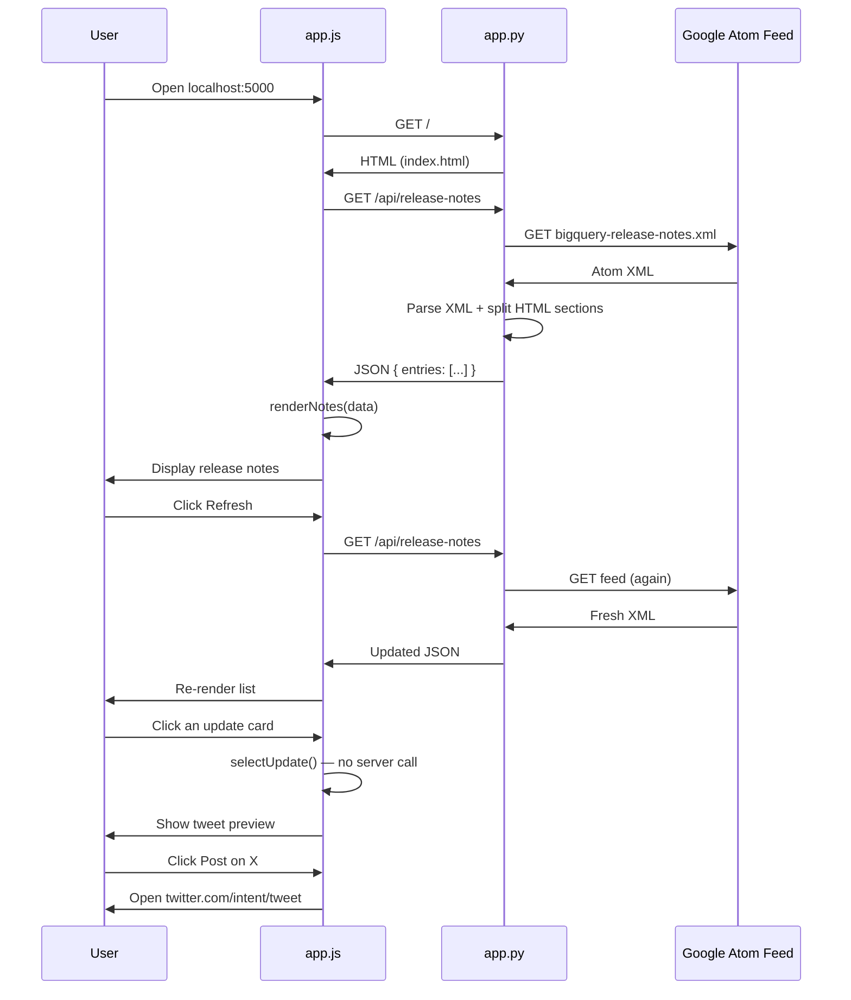

# BigQuery Release Notes App — Project Guide

## What this app does

A small Flask web app that:

1. **Fetches** the official BigQuery release notes Atom XML feed from Google Cloud
2. **Parses** each day's entry into individual updates (Feature, Issue, etc.)
3. **Displays** them in a browser UI grouped by date
4. **Lets you refresh** the feed on demand (with a loading spinner)
5. **Lets you select** one update and compose a tweet to share on X

There is no database. Every refresh re-fetches the live feed from Google.

---

## Main features

| Feature | Where it lives | How it works |
|---------|----------------|--------------|
| Feed fetching | Server (`app.py`) | `requests.get()` downloads the Atom XML |
| XML parsing | Server (`app.py`) | `xml.etree.ElementTree` reads Atom `<entry>` elements |
| HTML section splitting | Server (`app.py`) | Regex splits `<h3>` blocks into separate updates |
| Plain-text extraction | Server (`app.py`) | `HTMLParser` strips tags for tweet text |
| JSON API | Server (`app.py`) | `/api/release-notes` returns structured JSON |
| Page shell | Client (`templates/index.html`) | Static HTML layout, no data embedded |
| Dynamic rendering | Client (`static/app.js`) | Builds DOM cards from JSON |
| Refresh + spinner | Client (`static/app.js` + `style.css`) | Disables button, shows CSS spinner while loading |
| Tweet composer | Client (`static/app.js`) | Builds X intent URL with pre-filled text |

---

## Architecture: Server vs Client

```
┌─────────────────────────────────────────────────────────────────────────┐
│                           BROWSER (Client)                              │
│  templates/index.html  +  static/style.css  +  static/app.js            │
│                                                                         │
│  • Renders page shell                                                   │
│  • Calls GET /api/release-notes via fetch()                             │
│  • Builds update cards in the DOM                                       │
│  • Handles refresh button, selection, tweet preview                     │
└───────────────────────────────┬─────────────────────────────────────────┘
                                │ HTTP
                                ▼
┌─────────────────────────────────────────────────────────────────────────┐
│                         FLASK SERVER (app.py)                           │
│                                                                         │
│  GET /                  → render_template("index.html")                 │
│  GET /api/release-notes → fetch XML → parse → return JSON               │
└───────────────────────────────┬─────────────────────────────────────────┘
                                │ HTTPS
                                ▼
┌─────────────────────────────────────────────────────────────────────────┐
│              Google Cloud (external)                                    │
│  https://docs.cloud.google.com/feeds/bigquery-release-notes.xml         │
└─────────────────────────────────────────────────────────────────────────┘
```

### Server side (Python / Flask)

| File | Role |
|------|------|
| `app.py` | Flask app, feed fetcher, XML/HTML parser, JSON API |
| `requirements.txt` | `flask`, `requests` |

**Responsibilities:**
- Serve the HTML page at `/`
- Proxy and transform the external XML feed into clean JSON
- Handle network and parse errors with HTTP status codes

### Client side (HTML / CSS / JavaScript)

| File | Role |
|------|------|
| `templates/index.html` | Page structure: header, notes panel, tweet sidebar |
| `static/style.css` | Layout, cards, spinner animation, responsive grid |
| `static/app.js` | Fetch data, render UI, selection state, tweet builder |

**Responsibilities:**
- All interactivity happens in the browser
- No page reloads after initial load (SPA-like behavior via `fetch`)
- Tweet posting opens X in a new tab (no Twitter API keys needed)

---

## Sample flow: User clicks Refresh

### Step 1 — User action (Client)

User clicks **Refresh** → `app.js` calls `loadReleaseNotes()`.

```javascript
setLoading(true);                              // disable button, show spinner
statusEl.textContent = "Loading release notes...";
const response = await fetch("/api/release-notes");
const data = await response.json();
```

### Step 2 — API request (Client → Server)

```
GET /api/release-notes HTTP/1.1
Host: localhost:5000
Accept: */*
```

### Step 3 — Server fetches external feed (Server → Google)

```python
response = requests.get(FEED_URL, timeout=30)  # Google Atom XML
root = ET.fromstring(response.content)         # parse XML
# ... split entries, parse HTML sections ...
return jsonify(data)
```

### Step 4 — API response (Server → Client)

**Success — HTTP 200**

```json
{
  "feed_updated": "2026-06-15T00:00:00-07:00",
  "feed_url": "https://docs.cloud.google.com/feeds/bigquery-release-notes.xml",
  "entries": [
    {
      "id": "tag:google.com,2016:bigquery-release-notes#June_15_2026",
      "date": "June 15, 2026",
      "updated": "2026-06-15T00:00:00-07:00",
      "link": "https://docs.cloud.google.com/bigquery/docs/release-notes#June_15_2026",
      "updates": [
        {
          "id": 0,
          "category": "Feature",
          "html": "<p>Use Gemini Cloud Assist to analyze...</p>",
          "text": "Use Gemini Cloud Assist to analyze your SQL queries..."
        },
        {
          "id": 1,
          "category": "Issue",
          "html": "<p>Support for configuring daily token quotas...</p>",
          "text": "Support for configuring daily token quotas..."
        }
      ]
    }
  ]
}
```

**Failure — HTTP 502 (feed unreachable)**

```json
{
  "error": "Failed to fetch release notes: ..."
}
```

### Step 5 — Client renders (Client)

```javascript
renderNotes(data);                             // build date groups + update cards
statusEl.textContent = formatStatus(data.feed_updated);
setLoading(false);                             // hide spinner, re-enable button
```

### Step 6 — User selects an update (Client only, no server call)

User clicks an update card → `selectUpdate()` runs entirely in the browser:

1. Highlights the selected card
2. Shows preview in the sidebar
3. Builds tweet text: `BigQuery Feature (June 15, 2026): <summary>\n\n<link>`
4. Sets **Post on X** link to `https://twitter.com/intent/tweet?text=...`

---

## Sequence diagram



---

## `app.py` explained (section by section)

### Imports and constants (lines 1–12)

```python
FEED_URL = "https://docs.cloud.google.com/feeds/bigquery-release-notes.xml"
ATOM_NS = {"atom": "http://www.w3.org/2005/Atom"}
SECTION_PATTERN = re.compile(r"<h3>(.*?)</h3>\s*(.*?)(?=<h3>|$)", ...)
```

- `FEED_URL` — the single external data source
- `ATOM_NS` — XML namespace required to query Atom feed elements
- `SECTION_PATTERN` — regex that splits HTML content into `<h3>` category + body pairs

`TAG_PATTERN` is defined but unused (could be removed in a cleanup).

### `_TextExtractor` and `html_to_text()` (lines 15–32)

Google's feed stores update content as HTML inside `<content type="html">`. For tweets we need plain text.

`_TextExtractor` extends Python's `HTMLParser` and collects text nodes. `html_to_text()` feeds HTML in and returns a single plain-text string.

### `parse_sections()` (lines 35–47)

Takes one entry's HTML content and returns a list of updates:

```python
{
  "id": 0,           # index within that day's entry
  "category": "Feature",
  "html": "<p>...</p>",   # for display in the browser
  "text": "plain text"    # for tweet composition
}
```

Each `<h3>Feature</h3>` block becomes one selectable update card.

### `fetch_release_notes()` (lines 50–85)

The core data pipeline:

1. **Download** — `requests.get(FEED_URL)`
2. **Parse XML** — `ET.fromstring(response.content)`
3. **Loop entries** — each `<entry>` is one calendar day
4. **Extract fields** — `id`, `title` (date), `updated`, `link`, `content`
5. **Split content** — `parse_sections(content)` → multiple updates per day
6. **Return dict** — ready for `jsonify()`

### `create_app()` — Flask routes (lines 88–105)

| Route | Method | Returns |
|-------|--------|---------|
| `/` | GET | Rendered `index.html` (no data) |
| `/api/release-notes` | GET | JSON from `fetch_release_notes()` |

Error handling:
- `requests.RequestException` → **502** (bad gateway — upstream feed failed)
- `ET.ParseError` → **500** (server couldn't parse XML)

### App entry point (lines 108–111)

```python
app = create_app()

if __name__ == "__main__":
    app.run(debug=True, port=5000)
```

`create_app()` factory pattern makes the app testable. `debug=True` enables auto-reload during development.

---

## Data transformation example

**Raw Atom entry (simplified):**

```xml
<entry>
  <title>June 15, 2026</title>
  <link rel="alternate" href="https://docs.cloud.google.com/bigquery/docs/release-notes#June_15_2026"/>
  <content type="html"><![CDATA[
    <h3>Feature</h3><p>Use Gemini Cloud Assist...</p>
    <h3>Issue</h3><p>Support for configuring daily token quotas...</p>
  ]]></content>
</entry>
```

**After `fetch_release_notes()` → one JSON entry with 2 updates:**

- Update 0: category `Feature`, html + text
- Update 1: category `Issue`, html + text

**After `renderNotes()` in the browser → DOM:**

```
June 15, 2026                    [View on docs]
  [Feature] Use Gemini Cloud Assist...
  [Issue]   Support for configuring daily token quotas...
```

---

## File map

```
bigquery-release-notes/
├── app.py                 ← Server: Flask + parser + API
├── requirements.txt
├── templates/
│   └── index.html         ← Client: page shell
└── static/
    ├── app.js             ← Client: logic
    └── style.css          ← Client: presentation
```

---

## Key design decisions

1. **Server proxies the feed** — avoids browser CORS issues with Google's XML URL
2. **JSON API + client rendering** — keeps page interactive without full reloads
3. **Regex for HTML sections** — simple and sufficient for Google's consistent `<h3>` format
4. **X intent URL for tweeting** — no OAuth or Twitter API setup required
5. **No persistence** — always shows live data from Google
